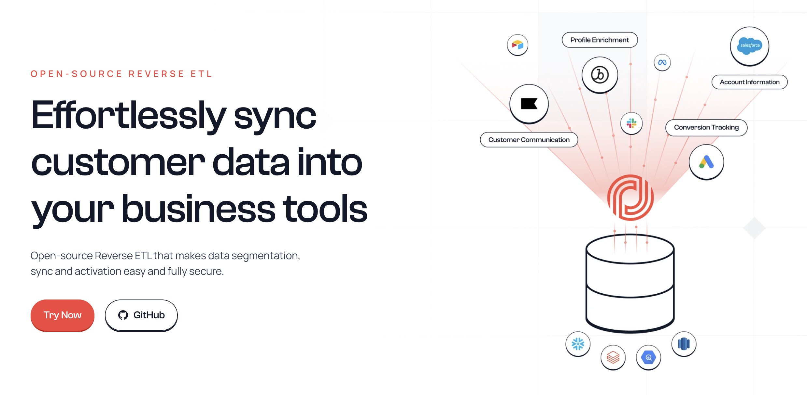

<div align="left">

[](https://www.multiwoven.com&#x2F;)

# [Multiwoven](https://www.multiwoven.com&#x2F;)<a id="multiwoven"></a>

Open-source Reverse ETL that makes data segmentation, sync and activation both easy and fully secure.

</div>

## Table of Contents<a id="table-of-contents"></a>

<!-- toc -->

- [Installation](#installation)
- [Getting Started](#getting-started)
- [Reference](#reference)
  * [`multiwoven.connectorDefinitions.checkConnection`](#multiwovenconnectordefinitionscheckconnection)
  * [`multiwoven.connectorDefinitions.getBasedOnType`](#multiwovenconnectordefinitionsgetbasedontype)
  * [`multiwoven.connectorDefinitions.getByName`](#multiwovenconnectordefinitionsgetbyname)
  * [`multiwoven.connectors.createNewConnector`](#multiwovenconnectorscreatenewconnector)
  * [`multiwoven.connectors.deleteById`](#multiwovenconnectorsdeletebyid)
  * [`multiwoven.connectors.discoverCatalogInfo`](#multiwovenconnectorsdiscovercataloginfo)
  * [`multiwoven.connectors.getById`](#multiwovenconnectorsgetbyid)
  * [`multiwoven.connectors.listAll`](#multiwovenconnectorslistall)
  * [`multiwoven.connectors.querySource`](#multiwovenconnectorsquerysource)
  * [`multiwoven.connectors.updateById`](#multiwovenconnectorsupdatebyid)
  * [`multiwoven.models.createModel`](#multiwovenmodelscreatemodel)
  * [`multiwoven.models.deleteModel`](#multiwovenmodelsdeletemodel)
  * [`multiwoven.models.getById`](#multiwovenmodelsgetbyid)
  * [`multiwoven.models.listAllModels`](#multiwovenmodelslistallmodels)
  * [`multiwoven.models.updateModelById`](#multiwovenmodelsupdatemodelbyid)
  * [`multiwoven.reports.getDataBasedOnType`](#multiwovenreportsgetdatabasedontype)
  * [`multiwoven.syncRecords.listForSyncRun`](#multiwovensyncrecordslistforsyncrun)
  * [`multiwoven.syncRuns.listBySyncId`](#multiwovensyncrunslistbysyncid)
  * [`multiwoven.syncs.createNewSyncOperation`](#multiwovensyncscreatenewsyncoperation)
  * [`multiwoven.syncs.deleteSyncOperation`](#multiwovensyncsdeletesyncoperation)
  * [`multiwoven.syncs.getReportData`](#multiwovensyncsgetreportdata)
  * [`multiwoven.syncs.listOperations`](#multiwovensyncslistoperations)
  * [`multiwoven.syncs.showDetails`](#multiwovensyncsshowdetails)
  * [`multiwoven.syncs.updateSpecificSync`](#multiwovensyncsupdatespecificsync)

<!-- tocstop -->

## Installation<a id="installation"></a>
<div align="center">
  <a href="https://konfigthis.com/sdk-sign-up?company=Multiwoven&language=TypeScript">
    
  </a>
</div>

## Getting Started<a id="getting-started"></a>

```typescript
import { Multiwoven } from "multiwoven-typescript-sdk";

const multiwoven = new Multiwoven({
  // Defining the base path is optional and defaults to https://api.multiwoven.com
  // basePath: "https://api.multiwoven.com",
  accessToken: "ACCESS_TOKEN",
});

const checkConnectionResponse =
  await multiwoven.connectorDefinitions.checkConnection({
    type: "source",
  });

console.log(checkConnectionResponse);
```

## Reference<a id="reference"></a>


### `multiwoven.connectorDefinitions.checkConnection`<a id="multiwovenconnectordefinitionscheckconnection"></a>

Checks the connection for a specified connector definition

#### 🛠️ Usage<a id="🛠️-usage"></a>

```typescript
const checkConnectionResponse =
  await multiwoven.connectorDefinitions.checkConnection({
    type: "source",
  });
```

#### ⚙️ Parameters<a id="⚙️-parameters"></a>

##### type: `string`<a id="type-string"></a>

##### name: `string`<a id="name-string"></a>

##### connection_spec: `{ [key: string]: any; }`<a id="connection_spec--key-string-any-"></a>

Generic connection specification structure. Specifics depend on the connector type.

#### 🔄 Return<a id="🔄-return"></a>

[ConnectorDefinitionsCheckConnectionResponse](./models/connector-definitions-check-connection-response.ts)

#### 🌐 Endpoint<a id="🌐-endpoint"></a>

`/api/v1/connector_definitions/check_connection` `POST`

[🔙 **Back to Table of Contents**](#table-of-contents)

---


### `multiwoven.connectorDefinitions.getBasedOnType`<a id="multiwovenconnectordefinitionsgetbasedontype"></a>

Retrieve connector definitions based on type

#### 🛠️ Usage<a id="🛠️-usage"></a>

```typescript
const getBasedOnTypeResponse =
  await multiwoven.connectorDefinitions.getBasedOnType({
    type: "source",
  });
```

#### ⚙️ Parameters<a id="⚙️-parameters"></a>

##### type: `'source' | 'destination'`<a id="type-source--destination"></a>

Type of the connector (source or destination)

#### 🔄 Return<a id="🔄-return"></a>

[ConnectorDefinitionsGetBasedOnTypeResponseInner](./models/connector-definitions-get-based-on-type-response-inner.ts)

#### 🌐 Endpoint<a id="🌐-endpoint"></a>

`/api/v1/connector_definitions` `GET`

[🔙 **Back to Table of Contents**](#table-of-contents)

---


### `multiwoven.connectorDefinitions.getByName`<a id="multiwovenconnectordefinitionsgetbyname"></a>

Retrieve specific connector definition based on its name

#### 🛠️ Usage<a id="🛠️-usage"></a>

```typescript
const getByNameResponse = await multiwoven.connectorDefinitions.getByName({
  connectorName: "connectorName_example",
  type: "source",
});
```

#### ⚙️ Parameters<a id="⚙️-parameters"></a>

##### connectorName: `string`<a id="connectorname-string"></a>

Name of the connector

##### type: `'source' | 'destination'`<a id="type-source--destination"></a>

Type of the connector (source or destination)

#### 🔄 Return<a id="🔄-return"></a>

[ConnectorDefinitionsGetByNameResponse](./models/connector-definitions-get-by-name-response.ts)

#### 🌐 Endpoint<a id="🌐-endpoint"></a>

`/api/v1/connector_definitions/{connector_name}` `GET`

[🔙 **Back to Table of Contents**](#table-of-contents)

---


### `multiwoven.connectors.createNewConnector`<a id="multiwovenconnectorscreatenewconnector"></a>

Creates a connector

#### 🛠️ Usage<a id="🛠️-usage"></a>

```typescript
const createNewConnectorResponse =
  await multiwoven.connectors.createNewConnector({});
```

#### ⚙️ Parameters<a id="⚙️-parameters"></a>

##### connector: [`ConnectorsCreateNewConnectorRequestConnector`](./models/connectors-create-new-connector-request-connector.ts)<a id="connector-connectorscreatenewconnectorrequestconnectormodelsconnectors-create-new-connector-request-connectorts"></a>

#### 🔄 Return<a id="🔄-return"></a>

[ConnectorsCreateNewConnectorResponse](./models/connectors-create-new-connector-response.ts)

#### 🌐 Endpoint<a id="🌐-endpoint"></a>

`/api/v1/connectors` `POST`

[🔙 **Back to Table of Contents**](#table-of-contents)

---


### `multiwoven.connectors.deleteById`<a id="multiwovenconnectorsdeletebyid"></a>

Deletes a specific connector by ID

#### 🛠️ Usage<a id="🛠️-usage"></a>

```typescript
const deleteByIdResponse = await multiwoven.connectors.deleteById({
  id: "id_example",
});
```

#### ⚙️ Parameters<a id="⚙️-parameters"></a>

##### id: `string`<a id="id-string"></a>

Unique ID of the connector

#### 🌐 Endpoint<a id="🌐-endpoint"></a>

`/api/v1/connectors/{id}` `DELETE`

[🔙 **Back to Table of Contents**](#table-of-contents)

---


### `multiwoven.connectors.discoverCatalogInfo`<a id="multiwovenconnectorsdiscovercataloginfo"></a>

Discovers catalog information for a specified connector

#### 🛠️ Usage<a id="🛠️-usage"></a>

```typescript
const discoverCatalogInfoResponse =
  await multiwoven.connectors.discoverCatalogInfo({
    id: "id_example",
  });
```

#### ⚙️ Parameters<a id="⚙️-parameters"></a>

##### id: `string`<a id="id-string"></a>

Unique ID of the connector

#### 🔄 Return<a id="🔄-return"></a>

[ConnectorsDiscoverCatalogInfoResponse](./models/connectors-discover-catalog-info-response.ts)

#### 🌐 Endpoint<a id="🌐-endpoint"></a>

`/api/v1/connectors/{id}/discover` `GET`

[🔙 **Back to Table of Contents**](#table-of-contents)

---


### `multiwoven.connectors.getById`<a id="multiwovenconnectorsgetbyid"></a>

Retrieves a specific connector by ID

#### 🛠️ Usage<a id="🛠️-usage"></a>

```typescript
const getByIdResponse = await multiwoven.connectors.getById({
  id: "id_example",
});
```

#### ⚙️ Parameters<a id="⚙️-parameters"></a>

##### id: `string`<a id="id-string"></a>

Unique ID of the connector

#### 🔄 Return<a id="🔄-return"></a>

[ConnectorsGetByIdResponse](./models/connectors-get-by-id-response.ts)

#### 🌐 Endpoint<a id="🌐-endpoint"></a>

`/api/v1/connectors/{id}` `GET`

[🔙 **Back to Table of Contents**](#table-of-contents)

---


### `multiwoven.connectors.listAll`<a id="multiwovenconnectorslistall"></a>

Lists all connectors

#### 🛠️ Usage<a id="🛠️-usage"></a>

```typescript
const listAllResponse = await multiwoven.connectors.listAll();
```

#### 🔄 Return<a id="🔄-return"></a>

[ConnectorsListAllResponse](./models/connectors-list-all-response.ts)

#### 🌐 Endpoint<a id="🌐-endpoint"></a>

`/api/v1/connectors` `GET`

[🔙 **Back to Table of Contents**](#table-of-contents)

---


### `multiwoven.connectors.querySource`<a id="multiwovenconnectorsquerysource"></a>

Query your source data

#### 🛠️ Usage<a id="🛠️-usage"></a>

```typescript
const querySourceResponse = await multiwoven.connectors.querySource({
  id: 1,
});
```

#### ⚙️ Parameters<a id="⚙️-parameters"></a>

##### id: `number`<a id="id-number"></a>

The ID of the connector to query

##### query: `string`<a id="query-string"></a>

SQL query to be executed

#### 🌐 Endpoint<a id="🌐-endpoint"></a>

`/api/v1/connectors/{id}/query_source` `POST`

[🔙 **Back to Table of Contents**](#table-of-contents)

---


### `multiwoven.connectors.updateById`<a id="multiwovenconnectorsupdatebyid"></a>

Updates a specific connector by ID

#### 🛠️ Usage<a id="🛠️-usage"></a>

```typescript
const updateByIdResponse = await multiwoven.connectors.updateById({
  id: "id_example",
});
```

#### ⚙️ Parameters<a id="⚙️-parameters"></a>

##### id: `string`<a id="id-string"></a>

Unique ID of the connector

##### connector: [`ConnectorsUpdateByIdRequestConnector`](./models/connectors-update-by-id-request-connector.ts)<a id="connector-connectorsupdatebyidrequestconnectormodelsconnectors-update-by-id-request-connectorts"></a>

#### 🔄 Return<a id="🔄-return"></a>

[ConnectorsUpdateByIdResponse](./models/connectors-update-by-id-response.ts)

#### 🌐 Endpoint<a id="🌐-endpoint"></a>

`/api/v1/connectors/{id}` `PUT`

[🔙 **Back to Table of Contents**](#table-of-contents)

---


### `multiwoven.models.createModel`<a id="multiwovenmodelscreatemodel"></a>

Creates a model

#### 🛠️ Usage<a id="🛠️-usage"></a>

```typescript
const createModelResponse = await multiwoven.models.createModel({});
```

#### ⚙️ Parameters<a id="⚙️-parameters"></a>

##### model: [`ModelsCreateModelRequestModel`](./models/models-create-model-request-model.ts)<a id="model-modelscreatemodelrequestmodelmodelsmodels-create-model-request-modelts"></a>

#### 🔄 Return<a id="🔄-return"></a>

[ModelsCreateModelResponse](./models/models-create-model-response.ts)

#### 🌐 Endpoint<a id="🌐-endpoint"></a>

`/api/v1/models` `POST`

[🔙 **Back to Table of Contents**](#table-of-contents)

---


### `multiwoven.models.deleteModel`<a id="multiwovenmodelsdeletemodel"></a>

Deletes a model

#### 🛠️ Usage<a id="🛠️-usage"></a>

```typescript
const deleteModelResponse = await multiwoven.models.deleteModel({
  id: 1,
});
```

#### ⚙️ Parameters<a id="⚙️-parameters"></a>

##### id: `number`<a id="id-number"></a>

#### 🌐 Endpoint<a id="🌐-endpoint"></a>

`/api/v1/models/{id}` `DELETE`

[🔙 **Back to Table of Contents**](#table-of-contents)

---


### `multiwoven.models.getById`<a id="multiwovenmodelsgetbyid"></a>

Retrieves a model

#### 🛠️ Usage<a id="🛠️-usage"></a>

```typescript
const getByIdResponse = await multiwoven.models.getById({
  id: 1,
});
```

#### ⚙️ Parameters<a id="⚙️-parameters"></a>

##### id: `number`<a id="id-number"></a>

#### 🔄 Return<a id="🔄-return"></a>

[ModelsGetByIdResponse](./models/models-get-by-id-response.ts)

#### 🌐 Endpoint<a id="🌐-endpoint"></a>

`/api/v1/models/{id}` `GET`

[🔙 **Back to Table of Contents**](#table-of-contents)

---


### `multiwoven.models.listAllModels`<a id="multiwovenmodelslistallmodels"></a>

Lists all models

#### 🛠️ Usage<a id="🛠️-usage"></a>

```typescript
const listAllModelsResponse = await multiwoven.models.listAllModels();
```

#### 🔄 Return<a id="🔄-return"></a>

[ModelsListAllModelsResponse](./models/models-list-all-models-response.ts)

#### 🌐 Endpoint<a id="🌐-endpoint"></a>

`/api/v1/models` `GET`

[🔙 **Back to Table of Contents**](#table-of-contents)

---


### `multiwoven.models.updateModelById`<a id="multiwovenmodelsupdatemodelbyid"></a>

Updates a model

#### 🛠️ Usage<a id="🛠️-usage"></a>

```typescript
const updateModelByIdResponse = await multiwoven.models.updateModelById({
  id: 1,
});
```

#### ⚙️ Parameters<a id="⚙️-parameters"></a>

##### id: `number`<a id="id-number"></a>

##### model: [`ModelsCreateModelRequestModel`](./models/models-create-model-request-model.ts)<a id="model-modelscreatemodelrequestmodelmodelsmodels-create-model-request-modelts"></a>

#### 🔄 Return<a id="🔄-return"></a>

[ModelsUpdateModelByIdResponse](./models/models-update-model-by-id-response.ts)

#### 🌐 Endpoint<a id="🌐-endpoint"></a>

`/api/v1/models/{id}` `PUT`

[🔙 **Back to Table of Contents**](#table-of-contents)

---


### `multiwoven.reports.getDataBasedOnType`<a id="multiwovenreportsgetdatabasedontype"></a>

Get report data based on given type

#### 🛠️ Usage<a id="🛠️-usage"></a>

```typescript
const getDataBasedOnTypeResponse = await multiwoven.reports.getDataBasedOnType({
  type: "workspace_activity",
  metric: "sync_run_triggered",
  timePeriod: "one_week",
});
```

#### ⚙️ Parameters<a id="⚙️-parameters"></a>

##### type: `'workspace_activity'`<a id="type-workspace_activity"></a>

Type of the report to query.

##### metric: `'sync_run_triggered' | 'total_sync_run_rows' | 'all'`<a id="metric-sync_run_triggered--total_sync_run_rows--all"></a>

Specific metric of interest in the report.

##### connectorIds: `number`[]<a id="connectorids-number"></a>

IDs of the connectors.

##### timePeriod: `'one_week' | 'one_day'`<a id="timeperiod-one_week--one_day"></a>

Time period for the report.

#### 🔄 Return<a id="🔄-return"></a>

[ReportsGetDataBasedOnTypeResponse](./models/reports-get-data-based-on-type-response.ts)

#### 🌐 Endpoint<a id="🌐-endpoint"></a>

`/api/v1/reports` `GET`

[🔙 **Back to Table of Contents**](#table-of-contents)

---


### `multiwoven.syncRecords.listForSyncRun`<a id="multiwovensyncrecordslistforsyncrun"></a>

Retrieves a list of sync records for a specific sync run, optionally filtered by status.

#### 🛠️ Usage<a id="🛠️-usage"></a>

```typescript
const listForSyncRunResponse = await multiwoven.syncRecords.listForSyncRun({
  syncId: 1,
  syncRunId: 1,
});
```

#### ⚙️ Parameters<a id="⚙️-parameters"></a>

##### syncId: `number`<a id="syncid-number"></a>

The ID of the sync to list records for.

##### syncRunId: `number`<a id="syncrunid-number"></a>

The ID of the sync run to list records for.

##### status: `string`<a id="status-string"></a>

Optional status to filter the sync records by.

##### page: `number`<a id="page-number"></a>

Page number for pagination.

#### 🔄 Return<a id="🔄-return"></a>

[SyncRecordsListForSyncRunResponse](./models/sync-records-list-for-sync-run-response.ts)

#### 🌐 Endpoint<a id="🌐-endpoint"></a>

`/api/v1/syncs/{sync_id}/sync_runs/{sync_run_id}/sync_records` `GET`

[🔙 **Back to Table of Contents**](#table-of-contents)

---


### `multiwoven.syncRuns.listBySyncId`<a id="multiwovensyncrunslistbysyncid"></a>

Retrieves a list of sync runs for a specific sync, optionally filtered by status.

#### 🛠️ Usage<a id="🛠️-usage"></a>

```typescript
const listBySyncIdResponse = await multiwoven.syncRuns.listBySyncId({
  syncId: 1,
});
```

#### ⚙️ Parameters<a id="⚙️-parameters"></a>

##### syncId: `number`<a id="syncid-number"></a>

The ID of the sync to list runs for.

##### status: `string`<a id="status-string"></a>

Optional status to filter the sync runs by.

##### page: `number`<a id="page-number"></a>

Page number for pagination.

#### 🔄 Return<a id="🔄-return"></a>

[SyncRunsListBySyncIdResponse](./models/sync-runs-list-by-sync-id-response.ts)

#### 🌐 Endpoint<a id="🌐-endpoint"></a>

`/api/v1/syncs/{sync_id}/sync_runs` `GET`

[🔙 **Back to Table of Contents**](#table-of-contents)

---


### `multiwoven.syncs.createNewSyncOperation`<a id="multiwovensyncscreatenewsyncoperation"></a>

Create a new sync operation

#### 🛠️ Usage<a id="🛠️-usage"></a>

```typescript
const createNewSyncOperationResponse =
  await multiwoven.syncs.createNewSyncOperation({});
```

#### ⚙️ Parameters<a id="⚙️-parameters"></a>

##### sync: [`SyncsCreateNewSyncOperationRequestSync`](./models/syncs-create-new-sync-operation-request-sync.ts)<a id="sync-syncscreatenewsyncoperationrequestsyncmodelssyncs-create-new-sync-operation-request-syncts"></a>

#### 🔄 Return<a id="🔄-return"></a>

[SyncsCreateNewSyncOperationResponse](./models/syncs-create-new-sync-operation-response.ts)

#### 🌐 Endpoint<a id="🌐-endpoint"></a>

`/api/v1/syncs` `POST`

[🔙 **Back to Table of Contents**](#table-of-contents)

---


### `multiwoven.syncs.deleteSyncOperation`<a id="multiwovensyncsdeletesyncoperation"></a>

Delete a specific sync operation

#### 🛠️ Usage<a id="🛠️-usage"></a>

```typescript
const deleteSyncOperationResponse = await multiwoven.syncs.deleteSyncOperation({
  id: "id_example",
});
```

#### ⚙️ Parameters<a id="⚙️-parameters"></a>

##### id: `string`<a id="id-string"></a>

The ID of the sync operation to delete

#### 🌐 Endpoint<a id="🌐-endpoint"></a>

`/api/v1/syncs/{id}` `DELETE`

[🔙 **Back to Table of Contents**](#table-of-contents)

---


### `multiwoven.syncs.getReportData`<a id="multiwovensyncsgetreportdata"></a>

Get report data based on given type

#### 🛠️ Usage<a id="🛠️-usage"></a>

```typescript
const getReportDataResponse = await multiwoven.syncs.getReportData();
```

#### 🔄 Return<a id="🔄-return"></a>

[SyncsGetReportDataResponse](./models/syncs-get-report-data-response.ts)

#### 🌐 Endpoint<a id="🌐-endpoint"></a>

`/api/v1/syncs/configurations` `GET`

[🔙 **Back to Table of Contents**](#table-of-contents)

---


### `multiwoven.syncs.listOperations`<a id="multiwovensyncslistoperations"></a>

List all sync operations

#### 🛠️ Usage<a id="🛠️-usage"></a>

```typescript
const listOperationsResponse = await multiwoven.syncs.listOperations({});
```

#### ⚙️ Parameters<a id="⚙️-parameters"></a>

##### pageNumber: `number`<a id="pagenumber-number"></a>

Page number for pagination

##### pageSize: `number`<a id="pagesize-number"></a>

Number of items per page for pagination

#### 🔄 Return<a id="🔄-return"></a>

[SyncsListOperationsResponse](./models/syncs-list-operations-response.ts)

#### 🌐 Endpoint<a id="🌐-endpoint"></a>

`/api/v1/syncs` `GET`

[🔙 **Back to Table of Contents**](#table-of-contents)

---


### `multiwoven.syncs.showDetails`<a id="multiwovensyncsshowdetails"></a>

Show details of a specific sync operation

#### 🛠️ Usage<a id="🛠️-usage"></a>

```typescript
const showDetailsResponse = await multiwoven.syncs.showDetails({
  id: "id_example",
});
```

#### ⚙️ Parameters<a id="⚙️-parameters"></a>

##### id: `string`<a id="id-string"></a>

#### 🔄 Return<a id="🔄-return"></a>

[SyncsShowDetailsResponse](./models/syncs-show-details-response.ts)

#### 🌐 Endpoint<a id="🌐-endpoint"></a>

`/api/v1/syncs/{id}` `GET`

[🔙 **Back to Table of Contents**](#table-of-contents)

---


### `multiwoven.syncs.updateSpecificSync`<a id="multiwovensyncsupdatespecificsync"></a>

Update a specific sync operation

#### 🛠️ Usage<a id="🛠️-usage"></a>

```typescript
const updateSpecificSyncResponse = await multiwoven.syncs.updateSpecificSync({
  id: "id_example",
});
```

#### ⚙️ Parameters<a id="⚙️-parameters"></a>

##### id: `string`<a id="id-string"></a>

##### sync: [`SyncsUpdateSpecificSyncRequestSync`](./models/syncs-update-specific-sync-request-sync.ts)<a id="sync-syncsupdatespecificsyncrequestsyncmodelssyncs-update-specific-sync-request-syncts"></a>

#### 🔄 Return<a id="🔄-return"></a>

[SyncsUpdateSpecificSyncResponse](./models/syncs-update-specific-sync-response.ts)

#### 🌐 Endpoint<a id="🌐-endpoint"></a>

`/api/v1/syncs/{id}` `PUT`

[🔙 **Back to Table of Contents**](#table-of-contents)

---


## Author<a id="author"></a>
This TypeScript package is automatically generated by [Konfig](https://konfigthis.com)
